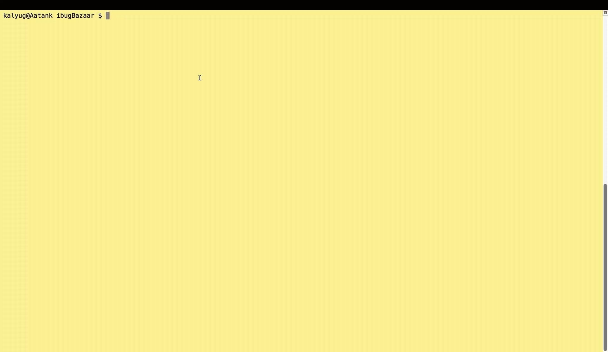

# OtoolAnalyze

This script has been developed to help perform Reverse Engineering of an iOS application, specifically the static analysis of an IPA file for detecting common security misconfigurations. We can complete a small portion of a very complex area in Cyber Security through this script - iOS Application Penetration Testing.

Following checks are performed by the script:
1. Address Space Layout Randomization (ASLR)
2. Stack Smashing Protection
3. Automatic Reference Counting (ARC)
4. Binary Encryption
5. Weak Hashing Algorithms
6. Insecure Random Number Generator Functions
7. Insecure Malloc Function
8. Deprecated Objective-C APIs

Refer to the links in the References section to get a detailed understanding of above checks.

### Dependencies

* otool (Part of XCode's command line tools)
* python3
* MacOS
* iOS Application's IPA file

### Preparation and Execution

* The script can be downloaded directly from the repo.
* Only the IPA file is needed for input. For ease of use, keep the iPA file and script in the same folder.
* Script can be run as follows.
```
python otool_analyze.py <IPA file>
```


### References

* [Analyzing the IPA like a Pro](https://blog.certcube.com/analyzing-the-ipa-like-a-pro/)
* [Basic Static Analysis iOS PT](https://book.hacktricks.xyz/mobile-pentesting/ios-pentesting#basic-static-analysis)
* [OWASP Mobile App Security Testing Guide - Section on otool](https://mas.owasp.org/MASTG/tools/ios/MASTG-TOOL-0060/)


### License

This project is licensed under the Apache 2.0 License - refer to the LICENSE.md file for further details.
